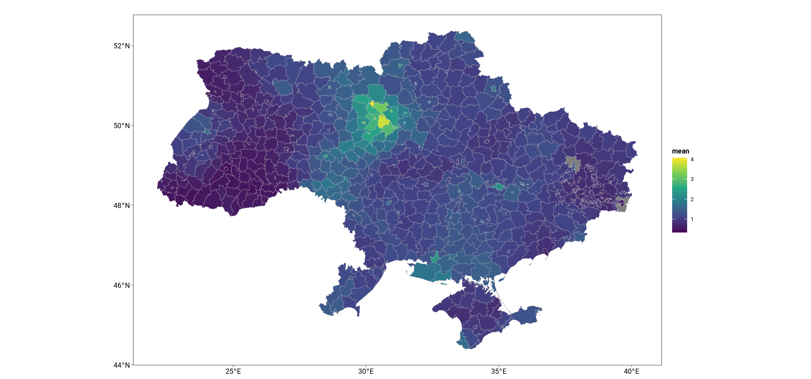
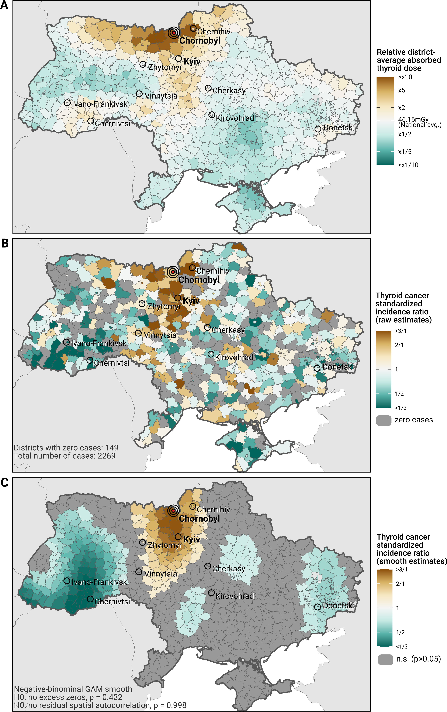

# 2025-03-07, Quadratic dose effect not needed

- without quadratic dose effect
  - loglike: 5144.981
  - DIC: 9305.6
- with quadratic dose effect
  - loglike: 5143.99
  - DIC: 9306.88
  - quadratic effect non significant (mean 1.566, sd 9.808)

# 2025-02-19

Evidence for screening effect in spatial effect:



# 2025-01-24

The non-linear ERR model can possibly be implemented in `inlabru`.

# 2025-01-23

I've noticed that the Log-linear model we are fitting is not identical to the ERR models in the radiation EPI-literature which have both linear and log-linear components. Crucially, the excess relative risk is modeled as a linear function of dosage whereas we model it as log-linear.

Our model:

```
Incidence(strata, dosage) =
  exp(LogBaselineRisk(strata)) x
  RelativeRisk(dosage, strata) x
  Population
```

ERR model:

```
Incidence(strata, dosage) =
  exp(LogBaselineRisk(strata)) x
  (1+ExcessRelativeRisk(dosage)exp(LogRiskRatios(strata))) x
  Population
  =
  LogBaselineRisk(strata) +
  Log(1+ExcessRelativeRisk(dosage)exp(LogRiskRatios(strata))) +
  Log(Population)
```

The ERR model has the advantage that the excess relative risk per Gy is positive under any risk modifier as long as the overall ERR effect is estimated to be positive. The slope of the ERR over dosage may vary over strata but will have the same sign. In the Poisson log-linear formulation however, the effect of dosage may change in direction depending on the strata.

# 2025-01-22

- Change from dummy coding to effects coding for sex variable
- make effect of radiation exposure dependent on age
- re-make age variable to "age at exposure"

# 2024-11-05

- screening effect (and other unobserved confounders) captured by spatial auto-correlation term -> effect size predictably decreases after inclusion of spatial auto-correlational

# 2024-11-01

We've received a rejection from European Journal of Epidemiology but with constructive reviews. We have to evaluate if it is possible to improve the paper further given the data that we have or if we have to aim for a worse journal.

I've read the reviews and I'm glad that they seem to be constructive criticism by experts. The only comment that annoyed me was the one about the Negative-Binomial distribution as we choose that for a very good reason and backed it with a test.

The two big things that stand out are a) modelling an age-dependent ERR, and b) addressing the issue of screening bias. We can and should address a), I'm not so sure about b).

> a) The formulation of the ERR is non-standard in the present study. The effect of two exponential dose responses with and without sex modifier is confusing. A sex-specific ERR could be ERRPD x dose x exp(bsex x msex) with dose effect modifier msex=-1/+1 for males/females.

We can do that with little effort.

> b) For thyroid risk the age dependence is crucial and needs to be considered explicitly. Risk estimation should concentrate on the vulnerable group of children and adolescents with age <= 18 in 1986. For 2001 that would include an age group 15-33 which should show a significantly higher risk compared to older ages. A dose effect modifier for age as continuous variable could also be tested. I recommend to consider the models of Furukawa et al. 2013 PMID: 22847218 or of UNSCEAR 2019 report Annex A. In the discussion of the ERR estimates from Tronko et al. JNCI 2006, Brenner et al. 2011 and Tronko et al. 2017 the mean cohort age should be applied to demonstrate a downward trend with age. In their discussion the authors acknowledge the missing age dependence as a weakness due to low cases numbers. However, investing in one additional parameter to model the age dependence should be feasible. One could apply likelihood ratio testing to address the usefulness of additional parameters.

We possibly can do that with moderate effort. This will necessitate additional plots to show the age-dependent estimates of ERR.

> c) A thorough discussion of confounders such as spatial distribution of nitrate levels in groundwater or iodine deficiency (see e.g.  UNSCEAR 2019 report Annex A). Differential screening regimes in contaminated areas compared to unaffected areas of Ukraine could have introduced additional bias. Could these confounders correlate spatially with the SIR estimates?

We can discuss that. We should highlight that we model residual spatial autocorrelation to capture exactly this sort of confounding.

> d) A comprehensive comparison of the ERR estimates from the present studies with those from earlier ecologic and cohort studies possibly with an additional figure or in tabular form.

Hard to compare in a tabular format as the estimates are not always comparable due to different model specification.

> e) A short evaluation of risk assessment for thyroid cancer after the Fukushima accident and also for Japanese a-bomb survivors would help to put the results of the present study into perspective.

We can do that.

> Table 1: for the baseline an algebraic age dependence exp(b0 + bage x ln(age/25)) should be tested to see if it improves the fit.

We can check that with little effort.

> Table1: are the zeta(i(j)) estimates spatially-correlated with thyroid dose? A strong correlation would point to a strong screening effect.

I can check, but I've yet to understand the comment.

> p5 top: it is unclear why the negative binomial distribution (NBS) should be applied to avoid overdispersion. The maps based on NBS look nice but do they provide interpretable results? If the data are overdispersed, a measure for overdispersion should be provided. Case counts are usually modeled with a Poisson distribution and overdispersion points to unexplained variation possibly caused by unknown confounders. Low case numbers can be avoided by aggregating the data in slightly larger spatial units. Has the data been tested on compatability with a Poisson distribution?

We need to explicitly write that we rejected the Poisson based on a test for overdispersion. This comment really annoys me as we did everything the comment asked for. Yes, Poisson is ill-specified because data are overdispersed as is almost always the case with count data. The ill-advised reliance of the field on the Poisson distribution should not count against our best efforts for proper analysis.

> Table 3: please give explicitly the parameter names, parameter MLEs and 95% CI plus the parameter units. What is the unit for the baseline rate?

Ok. Easy.

Reviewer #2: This is an ecological analysis of the Chornobyl fallout exposed population of Ukraine. The manuscript requires more detail in methods to evaluate it carefully and a more careful and balanced approach in its discussions and conclusions.

> 1.  Introduction: I do not find that the rationale is well supported. The health effects to cleanup workers are not generally comparable to residents exposed to radioiodine. Suggest focusing on the limitations in the literature for the objective of this specific scientific question.

> 2.  Introduction: The suggestion that the current studies are limited is misleading as those are large studies of the most exposed and vulnerable people with individual dose estimates who went through standardized screening for thyroid disease. The reason ecological studies have not been done is due to the strong potential for surveillance bias, as highly exposed people may be more likely to be screened. This account is missing from the introduction.

> 3.  Methods: It is unclear why only one year of incidence data (2001) was used.

> 4.  Methods: Was sex formally evaluated as an effect modifier?

> 5.  Methods: Age at exposure, not sex, is considered to be the most consistent modifier of the radiation dose-response for thyroid cancer. Suggest the authors include an evaluation of age at time of the accident in their model.

> 6.  Result:  Where are results by age at exposure/time of accident? It is not clear why these were not reported as they would be the most interesting scientifically and would support the validity of the study.

> 7.  Discussion: The major limitation of screening needs to be addressed in detail. One possibility is a sensitivity analysis of people who would not have been quite born yet at the time of the Chornobyl accident. Otherwise, it would be challenging to learn anything from this analysis.

> 8.  Discussion: District of diagnosis is assumed to be the place of exposure, but many people were relocated at the time of the accident as the authors note. However, examining the associations by urban/rural status or age at exposure may provide insights into the impact of this limitation.

# 2024-04-25

Attached you find the draft with updated tables. The numbers and formulas changed after the inclusion of the quadratic effect and I’ve updated the tables accordingly.
 
Please update the text and then send the draft back to me. I will then review the updated text.
 
What changed? We have much larger effect sizes now for the exposure which are more in line with the literature. All the main exposure effects are now significant, but we still can’t show significant sex differences in the exposure effects. This may be because there are none or because they are very hard to estimate as our huge confidence intervals seem to indicate.

# 2024-03-14

- include region level offset in model to control for region level policies
  - not very different results but harder to show Ukrainian average baseline rates, thus we won't include this effect
- include quadratic age effect
  - much higher excess relative risks per Gy
  - our model was misspecified before as the thyroid cancer incidence by age has a symmetric mode
  - we include quadratic now
- center age around 25

# 2024-02-09

- Liktharov excess relative risks / per gray
- Tronko excess relative risk / per gray
- Jacob excess relative risk as group comparison
  - excess relative risk dose dependence
- DEC: ERR/Gy
  - Jonas subtracts 1
  - autocorrelation
  - we can't do age-cohort

# 2024-01-10, Method description for Hampton

We have two estimation goals:

1) Get smooth district level estimates of standardized thyroid cancer incidence rates in ukraine 2001, and

2) estimate the exposure-risk-ratio of district average absorbed thyroid radiation dose in 1986 on thyroid cancer incidence in 2001 while controlling for sex, age and spatial autocorrelation.

## The data

The data are separately by district, sex, and age group:

  - thyroid cancer incidence counts 2001
  - midyear population 2001
  - per-person average received thyroid dosage measured in Gray

The data is very noisy as thyroid cancer incidence is super low. This is why we need a lot of modelling.



## Regarding estimate 1

Figure 1C (attached) shows you the estimated smooth SIRs of regional tyroid cancer incidence. We model total district level incidences separately by sex. The model is as follows:

  - `D_k ~ Negative-Binomial(µ_k, θ)`
  - `µ_k = exp(b0 + s(lat_k, lon_k) + log(expected_k))`
  - `θ = exp(b1)`

With <D_k> being the thyroid cancer incidence count in 2001 in district k, <s(lat_k, lon_k)> being a 2D spline smooth over the latitude and longitude centroid coordinates of each district and <expected_k> the expected thyroid cancer incidence in 2001 in district k if that district would have the same age and sex specific incidence rates per person as the Ukrainian average. The expected rates are included only as a logged offset so that the model equation can be rearranged to yield standardized incidence rates on the left-hand-side.

We run the model separately for females and males. We model with a negative binomial distribution as the data exhibits some degree of over-dispersion.

## Regarding estimate 2

For the exposure-risk-ratio estimate we run a negative binomial regression of district level average received thyroid dosage on district level thyroid cancer incidence. We control for age and sex and estimate sex specific exposure risk ratios.

As the naive model without spatial term is highly spatially correlated in the residuals we model the spatial correlation via a CAR term, i.e. we estimate an extra coefficient for each district which reflects the spatial dependency between neighboring districts.

The model can be formulated as

  - `D_i ~ Negative-Binomial(µ_i, θ)`
  - `µ_i = exp(b0 + b1*sex_i + b2*age_i + b3*dosageGy_i + b4*dosage_Gy*sex_i + z_k[i] + log(population_i))`

with <D_i> being the thyroid cancer incidence count for observation unit i (district x sex x age), <dosageGy_i> being the district average absorbed thyroid cancer incidence for a given age and sex stratum, <z_k[i]> being the spatial coefficient for district k belonging to observation unit i, and population being the midyear population in 2001 of the district-sex-age stratum.

Note that this model can be re-written as

`µ_i/population_i = exp(b0 + z_k[i] + b1*sex_i + b2*age_i)_baseline * exp(b3*dosageGy_i + b4*dosage_Gy*sex_i)_excess`

which means we factor the average thyroid cancer incidence rate <µ_i/population_i> into a baseline component (expected rate given 0 radiation exposure) and an excess component, which states by what ratio the thyroid cancer incidence rate is increased in unit i compared to a 0 exposure scenario.

The exposure risk ratio (relative increase in thyroid cancer incidence per additional Gy of dosage exposure) can then be derived from the estimated b3 and b4 coefficients. If sex=0 is mapped to males then exp(b3) is the factor by which the thyroid cancer incidence increases for an additional Gray of exposure for men, and exp(b3+b4) would be the same for females.

Attached you find a regression table as we will print it in the paper.

## Implementation

Estimate 1 is implemented using a GAM model in R using mgcv. Estimate 2 is implemented in R using INLA, a regression framework for approximate (and fast) Bayesian inference. I've attached the code for the models but can't share the data at this point. The following things are a bit tricky to implement:

- you need a neighborhood matrix for your spatial areas to implement the CAR model, i.e. which spatial area neighbors which
- in order to get confidence and prediction intervals around some of the derived statistics, and to perform a whole bunch of model checks (test for residual autocorrelation, zero-inflation, overdispersion) you need to simulate from the fitted model, this implementation is a bit tricky for INLA
- you need to manually calculate the district level expected incidences for the SIR smooth

# 2023-12-20

## How are the averages calculated?

- dosage by region and age:
  - population weighted average over sex
- national incidence rates by age and sex
  - population weighted average over region
- average dosage received by region and sex
  - population weighted average over age
- average national dosage received
  - population weighted average over age, sex, region